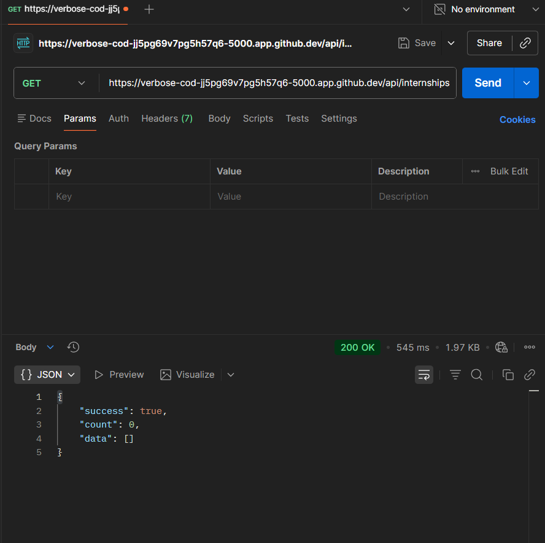
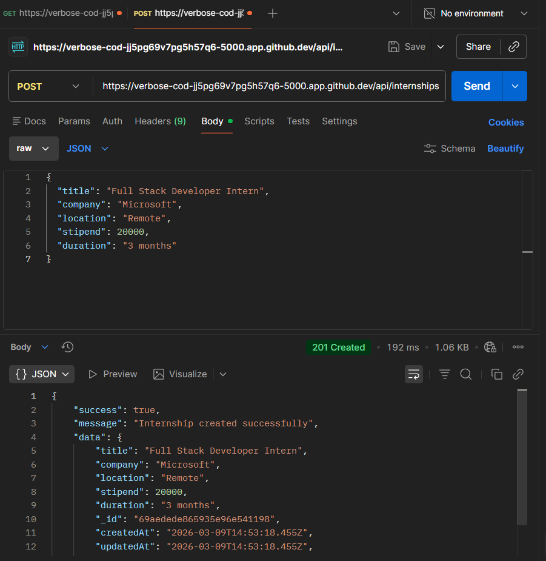
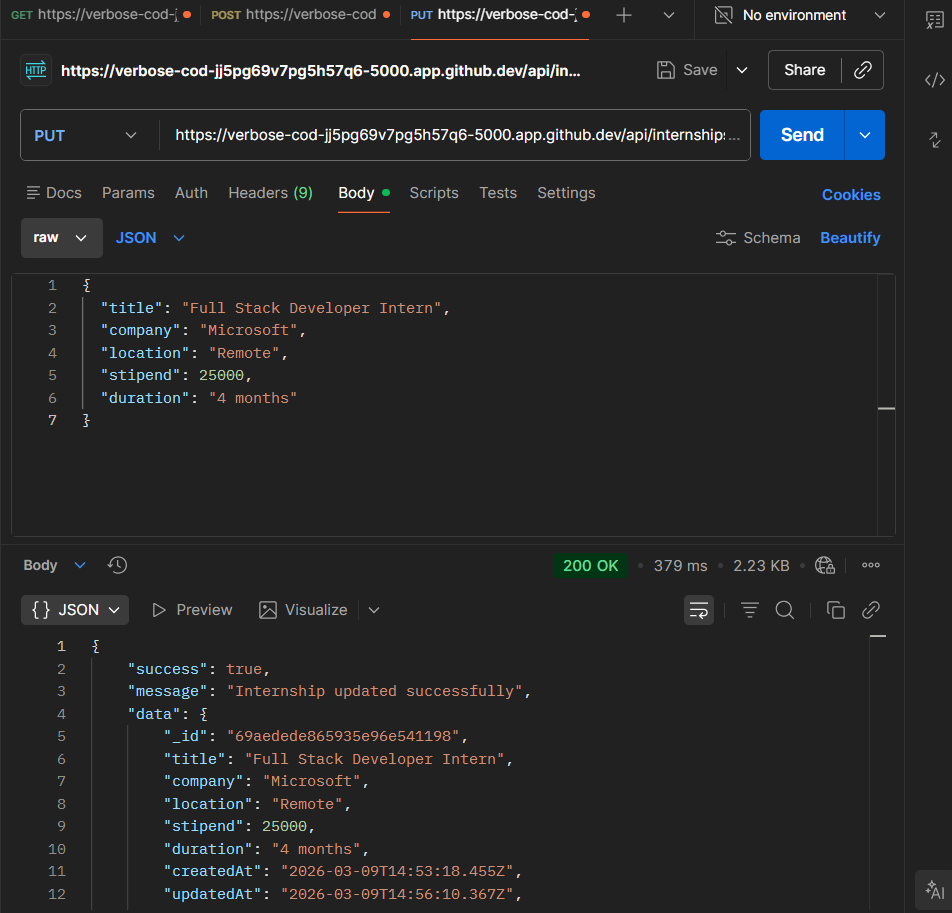
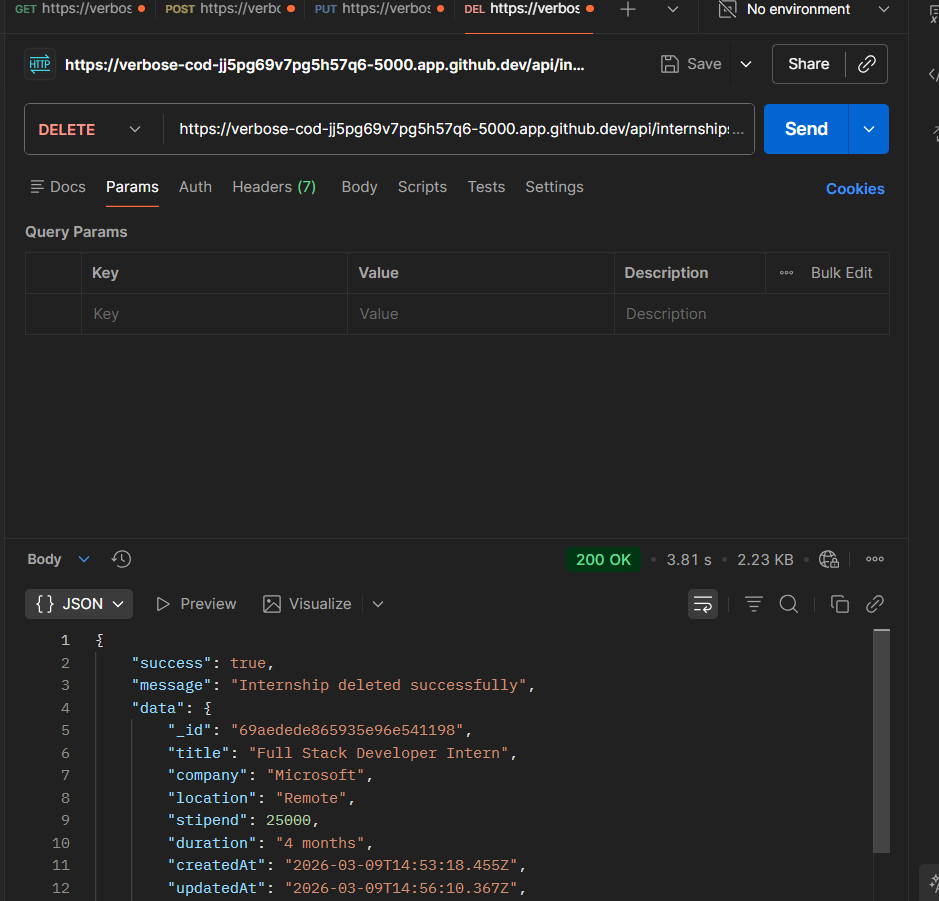

# 🚀 Smart Internship Portal

## 📌 Project Overview

The **Smart Internship Portal** is a full-stack web application designed to manage internship listings.
The backend is built using **Node.js, Express, and MongoDB**, providing a RESTful API that supports full **CRUD operations** for internships.

This project demonstrates real-world backend development practices such as:

* Database integration with MongoDB Atlas
* Mongoose schema modeling
* REST API design
* Async/Await based controllers
* MVC architecture
* Environment variable configuration

---

# 🛠 Tech Stack

### Backend

* Node.js
* Express.js
* MongoDB Atlas
* Mongoose
* dotenv

### Tools

* Postman (API testing)
* GitHub Codespaces
* Git & GitHub

---

# 🏗 Project Architecture

The project follows a **clean MVC architecture**:

Routes → Controllers → Models → Database

### Explanation

**Routes**

* Define API endpoints
* Connect HTTP requests to controllers

**Controllers**

* Handle business logic
* Process requests and return responses

**Models**

* Define MongoDB schema using Mongoose

**Database**

* MongoDB Atlas stores internship data

---

# 📂 Folder Structure

backend/
│
├── config/
│ └── db.js
│
├── controllers/
│ └── internshipController.js
│
├── models/
│ └── Internship.js
│
├── routes/
│ └── internships.js
│
├── .env
├── .gitignore
├── index.js
└── package.json

---

# 🔐 Environment Variables

Create a `.env` file inside the **backend folder**:

PORT=5000
MONGO_URI=your_mongodb_connection_string

⚠️ Never push `.env` files to GitHub.

---

# ▶️ Running the Project

### 1. Clone the repository

git clone <your-repository-url>

### 2. Navigate to backend

cd backend

### 3. Install dependencies

npm install

### 4. Start the server

npm start

Server will run on:

http://localhost:5000

---

# 📡 API Endpoints

### 1️⃣ Get All Internships

GET /api/internships

### 2️⃣ Get Internship by ID

GET /api/internships/:id

### 3️⃣ Create Internship

POST /api/internships

### 4️⃣ Update Internship

PUT /api/internships/:id

### 5️⃣ Delete Internship

DELETE /api/internships/:id

---

# 🧪 API Testing

All API endpoints were tested successfully using **Postman**.

The following operations were verified:

✔ Create internship
✔ Fetch all internships
✔ Fetch internship by ID
✔ Update internship
✔ Delete internship

---

# 📈 Key Concepts Demonstrated

* RESTful API development
* MongoDB CRUD operations
* MVC architecture
* Async/Await error handling
* Modular backend structure
* Environment variable configuration
* API testing using Postman

---

# 🚀 Future Improvements

* React frontend integration
* Internship search and filtering
* Authentication and authorization
* Admin dashboard
* Pagination for internship listings

---

## 📸 API Testing Screenshots

### GET Internships

### POST Internship

### PUT Update Internship

### DELETE Internship

---

# 👨‍💻 Author

Developed as a backend project to demonstrate **full-stack development concepts using Node.js and MongoDB**.
